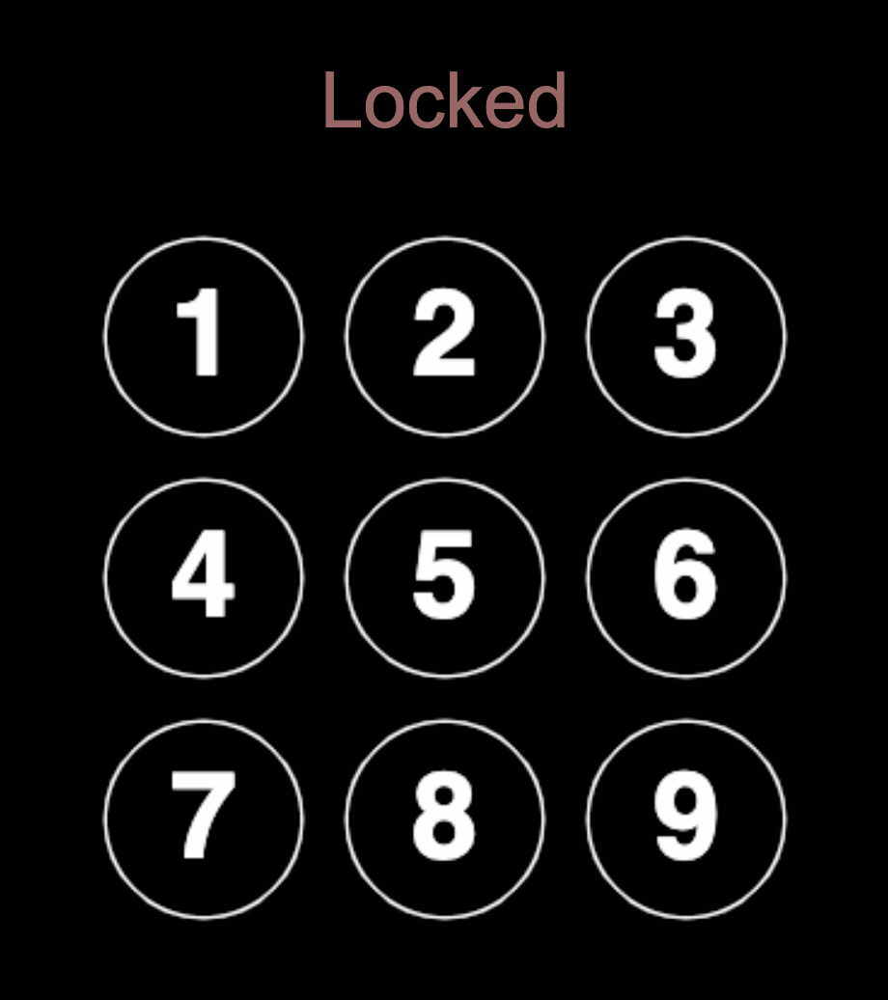

# RxJS Phonepad

A simple phone pad created using RxJS. The stream processing is all done in
[index.js](./index.js), and some helper functions are defined in [utils.js](./utils.js).

</img>

RxJS works by combining, buffering, merging and tweaking streams of data. It's
intended for use as a general-purpose asynchronous library, similar to how
Underscore provides a functional toolkit for synchronous code. 

To create this phone pad, the application combines streams of data from browser
events like clicks and mouse movements, mapping cursor positions to button
indices and building up information about the current password attempt.

Multiple subscriptions let the application build up the full password
attempt while also drawing a line between the previous and current buttons.

(The password is 1-2-3-5-8.)

## Building and running on localhost

First install dependencies:

```sh
yarn
```

To run in hot module reloading mode:

```sh
yarn start
```

To create a production build:

```sh
yarn build
```

## Running

```sh
node dist/bundle.js
```

### Credits

Made with [createapp.dev](https://createapp.dev/)

